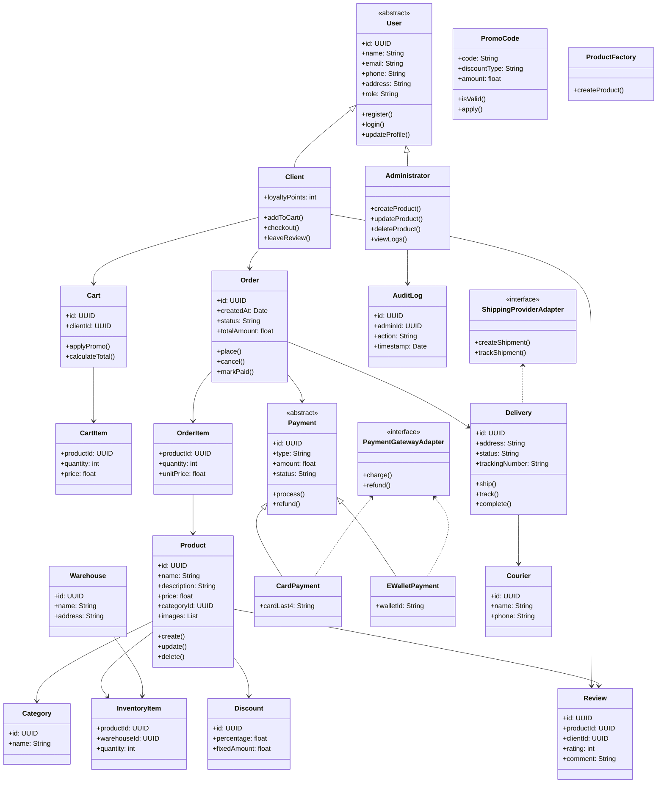

```mermaid 
classDiagram

%% === Users ===
class User {
  <<abstract>>
  +id: UUID
  +name: String
  +email: String
  +phone: String
  +address: String
  +role: String
  +register()
  +login()
  +updateProfile()
}

class Client {
  +loyaltyPoints: int
  +addToCart()
  +checkout()
  +leaveReview()
}

class Administrator {
  +createProduct()
  +updateProduct()
  +deleteProduct()
  +viewLogs()
}

User <|-- Client
User <|-- Administrator

%% === Products ===
class Product {
  +id: UUID
  +name: String
  +description: String
  +price: float
  +categoryId: UUID
  +images: List
  +create()
  +update()
  +delete()
}

class Category {
  +id: UUID
  +name: String
}

Product --> Category

%% === Inventory (multiple warehouses) ===
class Warehouse {
  +id: UUID
  +name: String
  +address: String
}

class InventoryItem {
  +productId: UUID
  +warehouseId: UUID
  +quantity: int
}

Product --> InventoryItem
Warehouse --> InventoryItem

%% === Cart / Orders ===
class Cart {
  +id: UUID
  +clientId: UUID
  +applyPromo()
  +calculateTotal()
}

class CartItem {
  +productId: UUID
  +quantity: int
  +price: float
}

Cart --> CartItem
Client --> Cart

class Order {
  +id: UUID
  +createdAt: Date
  +status: String
  +totalAmount: float
  +place()
  +cancel()
  +markPaid()
}

class OrderItem {
  +productId: UUID
  +quantity: int
  +unitPrice: float
}

Client --> Order
Order --> OrderItem
OrderItem --> Product

%% === Payments ===
class Payment {
  <<abstract>>
  +id: UUID
  +type: String
  +amount: float
  +status: String
  +process()
  +refund()
}
class CardPayment {
  +cardLast4: String
}
class EWalletPayment {
  +walletId: String
}
Payment <|-- CardPayment
Payment <|-- EWalletPayment
Order --> Payment

%% === Delivery ===
class Delivery {
  +id: UUID
  +address: String
  +status: String
  +trackingNumber: String
  +ship()
  +track()
  +complete()
}

class Courier {
  +id: UUID
  +name: String
  +phone: String
}

Order --> Delivery
Delivery --> Courier

%% === Promo / Discounts ===
class PromoCode {
  +code: String
  +discountType: String
  +amount: float
  +isValid()
  +apply()
}

class Discount {
  +id: UUID
  +percentage: float
  +fixedAmount: float
}

Product --> Discount

%% === Reviews ===
class Review {
  +id: UUID
  +productId: UUID
  +clientId: UUID
  +rating: int
  +comment: String
}

Client --> Review
Product --> Review

%% === Audit Logs ===
class AuditLog {
  +id: UUID
  +adminId: UUID
  +action: String
  +timestamp: Date
}

Administrator --> AuditLog

%% === Adapters (API integration) ===
class PaymentGatewayAdapter {
  <<interface>>
  +charge()
  +refund()
}
class ShippingProviderAdapter {
  <<interface>>
  +createShipment()
  +trackShipment()
}

PaymentGatewayAdapter <.. CardPayment
PaymentGatewayAdapter <.. EWalletPayment
ShippingProviderAdapter <.. Delivery

%% === Product Factory ===
class ProductFactory {
  +createProduct()
}

```
