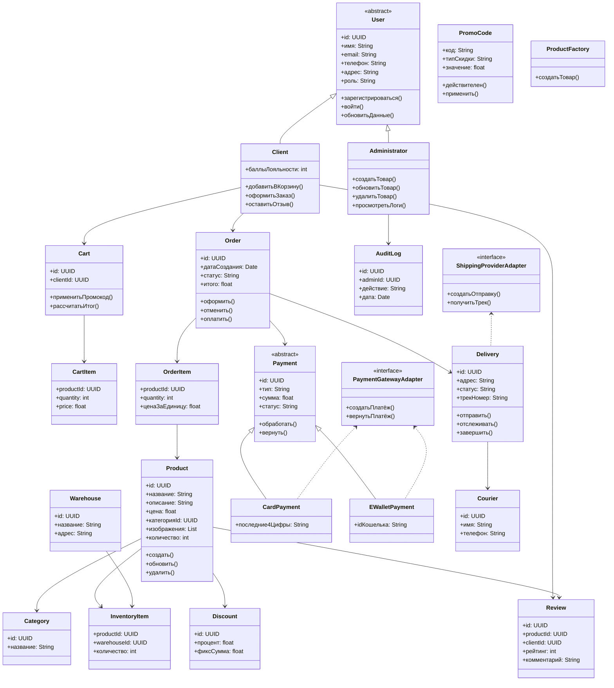

```mermaid 
classDiagram

%% === Пользователи ===
class User {
  <<abstract>>
  +id: UUID
  +имя: String
  +email: String
  +телефон: String
  +адрес: String
  +роль: String
  +зарегистрироваться()
  +войти()
  +обновитьДанные()
}

class Client {
  +баллыЛояльности: int
  +добавитьВКорзину()
  +оформитьЗаказ()
  +оставитьОтзыв()
}

class Administrator {
  +создатьТовар()
  +обновитьТовар()
  +удалитьТовар()
  +просмотретьЛоги()
}

User <|-- Client
User <|-- Administrator

%% === Товары ===
class Product {
  +id: UUID
  +название: String
  +описание: String
  +цена: float
  +категорияId: UUID
  +изображения: List
  +количество: int
  +создать()
  +обновить()
  +удалить()
}

class Category {
  +id: UUID
  +название: String
}

Product --> Category

%% === Склады (поддержка нескольких складов) ===
class Warehouse {
  +id: UUID
  +название: String
  +адрес: String
}

class InventoryItem {
  +productId: UUID
  +warehouseId: UUID
  +количество: int
}

Product --> InventoryItem
Warehouse --> InventoryItem

%% === Корзина и заказы ===
class Cart {
  +id: UUID
  +clientId: UUID
  +применитьПромокод()
  +рассчитатьИтог()
}

class CartItem {
  +productId: UUID
  +quantity: int
  +price: float
}

Cart --> CartItem
Client --> Cart

class Order {
  +id: UUID
  +датаСоздания: Date
  +статус: String
  +итого: float
  +оформить()
  +отменить()
  +оплатить()
}

class OrderItem {
  +productId: UUID
  +quantity: int
  +ценаЗаЕдиницу: float
}

Client --> Order
Order --> OrderItem
OrderItem --> Product

%% === Платежи ===
class Payment {
  <<abstract>>
  +id: UUID
  +тип: String
  +сумма: float
  +статус: String
  +обработать()
  +вернуть()
}

class CardPayment {
  +последние4Цифры: String
}

class EWalletPayment {
  +idКошелька: String
}

Payment <|-- CardPayment
Payment <|-- EWalletPayment
Order --> Payment

%% === Доставка ===
class Delivery {
  +id: UUID
  +адрес: String
  +статус: String
  +трекНомер: String
  +отправить()
  +отслеживать()
  +завершить()
}

class Courier {
  +id: UUID
  +имя: String
  +телефон: String
}

Order --> Delivery
Delivery --> Courier

%% === Скидки и промокоды ===
class PromoCode {
  +код: String
  +типСкидки: String
  +значение: float
  +действителен()
  +применить()
}

class Discount {
  +id: UUID
  +процент: float
  +фиксСумма: float
}

Product --> Discount

%% === Отзывы ===
class Review {
  +id: UUID
  +productId: UUID
  +clientId: UUID
  +рейтинг: int
  +комментарий: String
}

Client --> Review
Product --> Review

%% === Логи администраторов ===
class AuditLog {
  +id: UUID
  +adminId: UUID
  +действие: String
  +дата: Date
}

Administrator --> AuditLog

%% === Внешние интеграции (API) ===
class PaymentGatewayAdapter {
  <<interface>>
  +создатьПлатёж()
  +вернутьПлатёж()
}

class ShippingProviderAdapter {
  <<interface>>
  +создатьОтправку()
  +получитьТрек()
}

PaymentGatewayAdapter <.. CardPayment
PaymentGatewayAdapter <.. EWalletPayment
ShippingProviderAdapter <.. Delivery

%% === Фабрика товаров ===
class ProductFactory {
  +создатьТовар()
}

```
