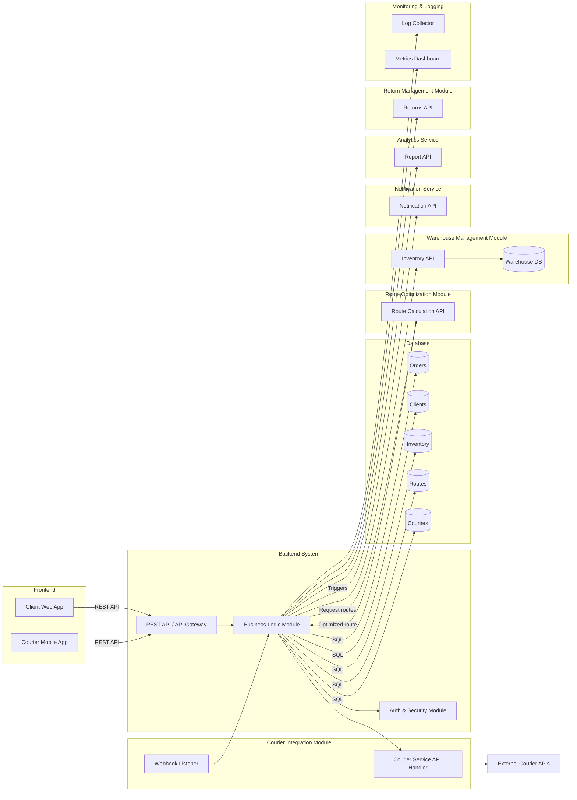

```mermaid    
flowchart LR

%% =========================
%% FRONTEND
%% =========================
subgraph FE[Frontend]
    FE_Web[Client Web App]
    FE_Mobile[Courier Mobile App]
end

%% =========================
%% BACKEND
%% =========================
subgraph BE[Backend System]
    BE_API[REST API / API Gateway]
    BE_Logic[Business Logic Module]
    BE_Auth[Auth & Security Module]
end

%% =========================
%% DATABASE
%% =========================
subgraph DB[Database]
    DB_Orders[(Orders)]
    DB_Clients[(Clients)]
    DB_Items[(Inventory)]
    DB_Routes[(Routes)]
    DB_Couriers[(Couriers)]
end

%% =========================
%% ROUTE OPTIMIZATION
%% =========================
subgraph ROUTE[Route Optimization Module]
    ROUTE_API[Route Calculation API]
end

%% =========================
%% WAREHOUSE MANAGEMENT
%% =========================
subgraph WH[Warehouse Management Module]
    WH_API[Inventory API]
    WH_SQL[(Warehouse DB)]
end

%% =========================
%% COURIER INTEGRATION
%% =========================
subgraph COURIER[Courier Integration Module]
    COURIER_API[Courier Service API Handler]
    COURIER_Webhook[Webhook Listener]
end

%% External courier APIs
E_CourierAPI[External Courier APIs]

%% =========================
%% NOTIFICATION SYSTEM
%% =========================
subgraph NOTIF[Notification Service]
    NOTIF_API[Notification API]
end

%% =========================
%% ANALYTICS SYSTEM
%% =========================
subgraph ANALYTICS[Analytics Service]
    ANALYTICS_Report[Report API]
end

%% =========================
%% OPTIONAL: RETURNS MODULE
%% =========================
subgraph RETURNS[Return Management Module]
    RETURNS_API[Returns API]
end

%% =========================
%% OPTIONAL: MONITORING
%% =========================
subgraph MONITOR[Monitoring & Logging]
    MONITOR_Logs[Log Collector]
    MONITOR_Metrics[Metrics Dashboard]
end

%% =========================
%% CONNECTIONS
%% =========================

%% Frontend → Backend
FE_Web -->|REST API| BE_API
FE_Mobile -->|REST API| BE_API

%% Backend internal connections
BE_API --> BE_Logic
BE_Logic --> BE_Auth

%% Backend → Database
BE_Logic -->|SQL| DB_Orders
BE_Logic -->|SQL| DB_Clients
BE_Logic -->|SQL| DB_Items
BE_Logic -->|SQL| DB_Routes
BE_Logic -->|SQL| DB_Couriers

%% Backend ↔ Route Optimization
BE_Logic -->|Request routes| ROUTE_API
ROUTE_API -->|Optimized route| BE_Logic

%% Backend ↔ Warehouse Module
BE_Logic --> WH_API
WH_API --> WH_SQL

%% Backend ↔ Courier Integration
BE_Logic --> COURIER_API
COURIER_Webhook --> BE_Logic
COURIER_API --> E_CourierAPI

%% Backend ↔ Notification Service
BE_Logic -->|Triggers| NOTIF_API

%% Backend ↔ Analytics
BE_Logic --> ANALYTICS_Report

%% Backend ↔ Returns (optional)
BE_Logic --> RETURNS_API

%% Backend ↔ Monitoring
BE_Logic --> MONITOR_Logs
BE_Logic --> MONITOR_Metrics


```
