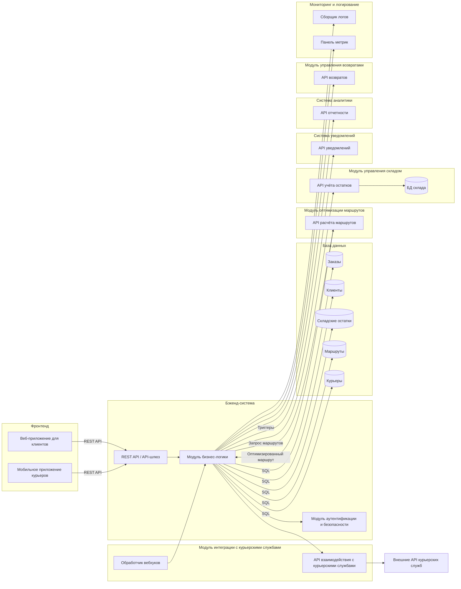

```mermaid    
flowchart LR

%% =========================
%% ФРОНТЕНД
%% =========================
subgraph FE[Фронтенд]
    FE_Web[Веб-приложение для клиентов]
    FE_Mobile[Мобильное приложение курьеров]
end

%% =========================
%% БЭКЕНД
%% =========================
subgraph BE[Бэкенд-система]
    BE_API[REST API / API-шлюз]
    BE_Logic[Модуль бизнес-логики]
    BE_Auth[Модуль аутентификации и безопасности]
end

%% =========================
%% БАЗА ДАННЫХ
%% =========================
subgraph DB[База данных]
    DB_Orders[(Заказы)]
    DB_Clients[(Клиенты)]
    DB_Items[(Складские остатки)]
    DB_Routes[(Маршруты)]
    DB_Couriers[(Курьеры)]
end

%% =========================
%% МОДУЛЬ ОПТИМИЗАЦИИ МАРШРУТОВ
%% =========================
subgraph ROUTE[Модуль оптимизации маршрутов]
    ROUTE_API[API расчёта маршрутов]
end

%% =========================
%% УПРАВЛЕНИЕ СКЛАДОМ
%% =========================
subgraph WH[Модуль управления складом]
    WH_API[API учёта остатков]
    WH_SQL[(БД склада)]
end

%% =========================
%% ИНТЕГРАЦИЯ С КУРЬЕРСКИМИ СЛУЖБАМИ
%% =========================
subgraph COURIER[Модуль интеграции с курьерскими службами]
    COURIER_API[API взаимодействия с курьерскими службами]
    COURIER_Webhook[Обработчик вебхуков]
end

%% Внешние API курьерских служб
E_CourierAPI[Внешние API курьерских служб]

%% =========================
%% СИСТЕМА УВЕДОМЛЕНИЙ
%% =========================
subgraph NOTIF[Система уведомлений]
    NOTIF_API[API уведомлений]
end

%% =========================
%% СИСТЕМА АНАЛИТИКИ
%% =========================
subgraph ANALYTICS[Система аналитики]
    ANALYTICS_Report[API отчетности]
end

%% =========================
%% ДОПОЛНИТЕЛЬНО: ВОЗВРАТЫ
%% =========================
subgraph RETURNS[Модуль управления возвратами]
    RETURNS_API[API возвратов]
end

%% =========================
%% ДОПОЛНИТЕЛЬНО: МОНИТОРИНГ
%% =========================
subgraph MONITOR[Мониторинг и логирование]
    MONITOR_Logs[Сборщик логов]
    MONITOR_Metrics[Панель метрик]
end

%% =========================
%% СВЯЗИ МЕЖДУ КОМПОНЕНТАМИ
%% =========================

%% Фронтенд → Бэкенд
FE_Web -->|REST API| BE_API
FE_Mobile -->|REST API| BE_API

%% Внутренние связи бэкенда
BE_API --> BE_Logic
BE_Logic --> BE_Auth

%% Бэкенд → База данных
BE_Logic -->|SQL| DB_Orders
BE_Logic -->|SQL| DB_Clients
BE_Logic -->|SQL| DB_Items
BE_Logic -->|SQL| DB_Routes
BE_Logic -->|SQL| DB_Couriers

%% Бэкенд ↔ Оптимизация маршрутов
BE_Logic -->|Запрос маршрутов| ROUTE_API
ROUTE_API -->|Оптимизированный маршрут| BE_Logic

%% Бэкенд ↔ Склад
BE_Logic --> WH_API
WH_API --> WH_SQL

%% Бэкенд ↔ Интеграция с курьерами
BE_Logic --> COURIER_API
COURIER_Webhook --> BE_Logic
COURIER_API --> E_CourierAPI

%% Бэкенд ↔ Уведомления
BE_Logic -->|Триггеры| NOTIF_API

%% Бэкенд ↔ Аналитика
BE_Logic --> ANALYTICS_Report

%% Бэкенд ↔ Возвраты
BE_Logic --> RETURNS_API

%% Бэкенд ↔ Мониторинг
BE_Logic --> MONITOR_Logs
BE_Logic --> MONITOR_Metrics
```
